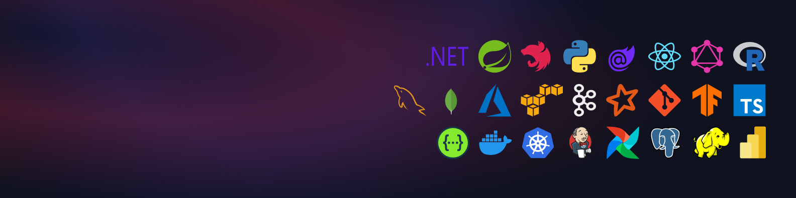

  <h1>Sahan Kodituwakku</h1>

  
As a Software and Data Engineer with a B.Sc. (Hons) in Computer Science from the University of Peradeniya, I bring a unique blend of backend engineering, data pipeline development, and applied machine learning to the table.

  
I have worked on large-scale eCommerce data processing pipelines, optimizing product search workflows using tools like MongoDB, Snowflake, Airflow, and AWS. Whether collaborating across Data Platform and Cloud Ops teams or fine-tuning systems with Grafana and Kibana, I focused on improving accuracy, speed, and reliability.

  
My academic research explored real-time road scene understanding through computer vision and geolocation data—building data pipelines with Kafka and Spark Streaming, and deploying U-Net-based segmentation models for driving assistance systems.

  
From developing queue management systems with .NET and React, to building Power BI dashboards for real-time bug tracking, my experience spans web, mobile, analytics, and cloud-native solutions.

  
I'm especially passionate about solving real-world problems with clean code, scalable systems, and thoughtful design—whether in software, data, or AI.

  

    
📍Currently based in Kandy, Sri Lanka.

    
📬 Let’s connect if you're working on data-centric products, intelligent systems, or simply want to collaborate on meaningful tech.

  

  

 

  
📫 Reach me via
 
  
<strong>sahan.crkodituwakku@gmail.com</strong>
  
  
<strong>+94 70 3413 298</strong>

<!-- 

  
  
  
  
  
  

 -->

<!---
kodiidok/kodiidok is a ✨ special ✨ repository because its `README.md` (this file) appears on your GitHub profile.
You can click the Preview link to take a look at your changes.
--->
